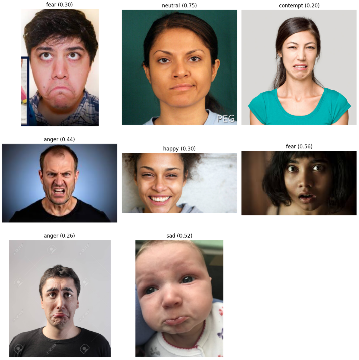

# Clasificación de Imágenes con CNN

Este proyecto entrena y prueba distintos modelos de Machine Learning para clasificación de imágenes, siendo las CNNs las que obtuvieron mejor desempeño. Incluye un modelo ya entrenado (`best_model.h5`) para que puedas probarlo directamente.

## Uso en Google Colab

1. Descarga el archivo de clasificación de imágenes para probar el modelo y el requeriments.txt, sera necesario que cambies la ruta donde carga el modelo por la ruta en "models/recognition_modelconv2d.h5" o "models/recognition_model.keras"
2. Ejecuta las celdas del notebook.
3. Sube imagenes de rostros para probar la clasificación.
4. Opcionalmente puedes usar mi código donde entreno los diferentes modelos y tratar de llegar a mejores resultados.

## Resultado al subir imagenes y probar el modelo

